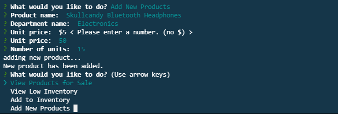

# Bamazon

## Bamazon is a command line retail store selling everything from electronics to home decor.

The main menu of Bamazon asks the user to identify themselves as either a manager or a customer. Let's look at **customer view** first:

In **customer view**, the user will be shown a table which lists the current available products. They will be prompted to enter the ID number of the product and the number of units that they want to purchase.

We assume that the customer is ready to buy, because why wouldn't they be?

**Notice:** only valid IDs will be accepted, and the number of units ordered must less than or equal to the number of units available (something that the customer cannot see from the table shown). If the criteria is not met, the customer will be asked to try again.

If the item ID is valid and the number of units desired is available, Bamazon will calculate the total cost and display that information to the customer. We want them to buy as many things as possible, so we display the products again and prompt them to buy more stuff!

Now that we've covered **customer view**, let's take a look at **manager view**

There are four options under manager view:

Selecting *view products for sale* simply shows the inventory available, including item id, name, price, and quantity available.

Then the manager can choose another option after he/she views the inventory. Maybe he wants to only see the items that have fewer than 5 units:

And then wants to add some units to one of those (or any) items.

Again, only valid item IDs will be accepted here.

We then ask the manager how many units they would like to add (numbers only), inform the manager that the inventory was updated, and display the menu so they can do more managing!

**Notice:** if we go back to *low inventory*, it has been updated to exclude the product we just added more units to.

The last option is to add a new product to the inventory. We ask for name, department, price, and quantity--the item ID is based on the row number. Again, input valdiation is crucial!

If we go back to check on the inventory, we see that the new product has been added!

That's it! Thanks for using Bamazon!
